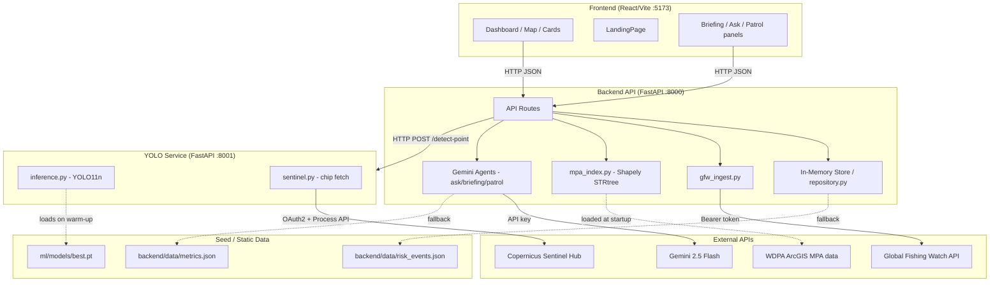
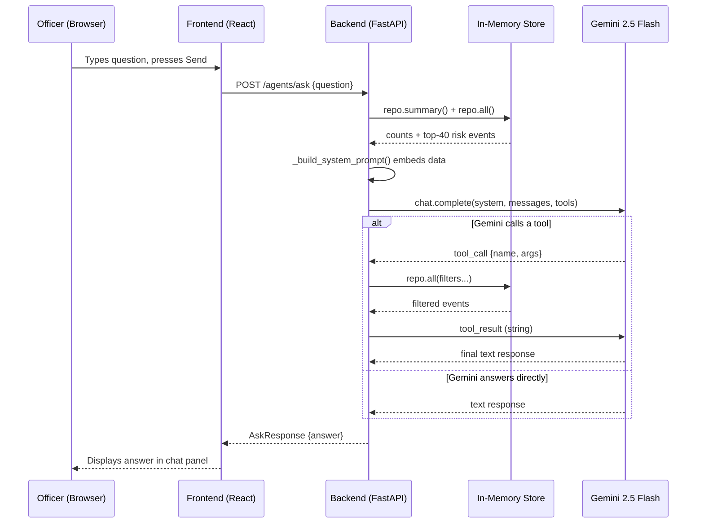

# OceanGuard AI — Deep Dive: Architecture, Data Flow, and Learning Guide

**Last updated: 2026-10-08**
All analysis is based on the actual repository files, not assumptions.
Verified code behavior is distinguished from intended design throughout.

---

## Table of Contents

1. [Architecture Overview](#1-architecture-overview)
2. [Complete Data Flow — One Request, End to End](#2-complete-data-flow)
3. [AI Architecture](#3-ai-architecture)
4. [System Design](#4-system-design)
5. [Learning Mode — Subsystem by Subsystem](#5-learning-mode)
6. [Comprehension Questions](#6-comprehension-questions)

---

## 1. Architecture Overview

### What problem does this solve?

Marine protected areas (MPAs) are frequently violated by fishing vessels that
switch off their AIS transponders to avoid detection. The operators responsible
for these areas lack the tooling to correlate satellite radar data, AIS
broadcasts, and geographic boundaries in near-real-time. OceanGuard solves that
by:

1. Pulling satellite SAR (Synthetic Aperture Radar) detection data from Global
   Fishing Watch (GFW) — vessels that radar sees regardless of AIS.
2. Cross-referencing those contacts with MPA boundaries (WDPA database).
3. Letting an officer trigger a YOLO deep-learning model on real Sentinel-1 imagery
   to independently verify any contact.
4. Generating AI summaries, patrol plans, and Q&A through Gemini 2.5 Flash.

### Major Components and Technology

```
┌─────────────────────────────────────────────────────────────────────┐
│  COMPONENT              TECHNOLOGY         WHAT IT DOES             │
├─────────────────────────────────────────────────────────────────────┤
│  Frontend               React 18           Dashboard UI, map, cards │
│                         TypeScript         Type safety               │
│                         Vite               Build/dev server          │
│                         Tailwind CSS       Styling                   │
│                         Leaflet            Interactive map           │
│                         Recharts           Model metrics charts      │
│                         Framer Motion      Animations               │
├─────────────────────────────────────────────────────────────────────┤
│  Backend API            FastAPI (Python)   REST endpoints            │
│                         Pydantic           Data validation           │
│                         pydantic-settings  Config from env vars      │
│                         httpx              HTTP client (GFW, YOLO)  │
│                         shapely            MPA spatial geometry      │
│                         rasterio           GeoTIFF reading           │
├─────────────────────────────────────────────────────────────────────┤
│  YOLO Service           FastAPI (Python)   Inference microservice    │
│                         PyTorch (CPU)      ML framework              │
│                         ultralytics        YOLO11n inference API     │
│                         Sentinel Hub API   SAR chip download        │
├─────────────────────────────────────────────────────────────────────┤
│  ML Pipeline (offline)  Python             Training & evaluation     │
│                         ultralytics YOLO   Fine-tuning               │
│                         rasterio           SAR GeoTIFF processing   │
│                         Azure ML           Cloud eval jobs           │
├─────────────────────────────────────────────────────────────────────┤
│  AI Agents              Google Gemini 2.5  Natural language layer    │
│                         Flash (API key)    (briefing, ask, patrol)   │
├─────────────────────────────────────────────────────────────────────┤
│  External Data          GFW API v3         SAR vessel presence cells │
│                         WDPA ArcGIS        MPA polygon boundaries   │
│                         AISStream.io       Live AIS broadcasts       │
│                         Copernicus CDSE    Sentinel-1 imagery        │
└─────────────────────────────────────────────────────────────────────┘
```

### How components communicate

```
Frontend (port 5173) ──HTTP JSON──► Backend API (port 8000)
                                           │
                    ┌──────────────────────┼─────────────────────┐
                    │                      │                      │
                    ▼                      ▼                      ▼
              GFW REST API          YOLO Service           Gemini API
           (gateway.api.gfw.org)    (port 8001)        (generativelanguage
                    │               Internal HTTP            .googleapis.com)
                    │                    │
                    ▼                    ▼
          ActivityAggregate        Sentinel Hub CDSE
              (stored in             (SAR image chips)
            in-memory repo)
```

### Mermaid Architecture Diagram



---

## 2. Complete Data Flow

### Scenario: Officer asks "Which vessel is highest risk?"

This is the most instructive path because it touches every layer.

**Files involved:**
- `frontend/src/components/AskOceanGuard.tsx` → user input
- `frontend/src/lib/api.ts` → `fetchAsk(question)`
- `backend/app/api/routes/ask.py` → `POST /agents/ask`
- `backend/app/agents/ask.py` → `ask(question)`
- `backend/app/agents/client.py` → Gemini API call
- `backend/app/store/repository.py` → `repo.all()`, `repo.summary()`
- Gemini 2.5 Flash → tool call + text response
- Returns `AskResponse` → frontend renders

#### Execution order (step by step)

```
Step 1  User types question in AskOceanGuard.tsx
        → React state update, POST to /agents/ask with { question: "..." }

Step 2  FastAPI route handler receives request
        File: backend/app/api/routes/ask.py
        Calls: await ask_agent.ask(question)

Step 3  ask.py builds the system prompt
        Function: _build_system_prompt()
        - Calls repo.summary() → counts (total, by level, near-MPA, pending)
        - Calls repo.all() → sorted list, takes top 40 by risk score
        - Embeds SYSTEM_KNOWLEDGE string (static description of how system works)
        - Embeds the top-40 table as text
        - Result: a ~3,000-token system prompt

Step 4  ask.py calls Gemini
        File: backend/app/agents/client.py → complete()
        - If GEMINI_API_KEY is empty → skips to Step 7 (fallback)
        - Sends: system prompt + user question + tool definitions (5 tools)
        - max_tokens = settings.agent_ask_max_tokens (700)

Step 5  Gemini decides to call a tool or answer directly
        If answering directly → returns text → Step 6
        If calling tool (e.g. query_detections) →
          ask.py executes _run_tool(name, args)
          → calls repo.all(level="HIGH", near_mpa=True, ...)
          → serialises result as string
          → appends tool result to messages
          → loops back to Gemini (up to agent_max_tool_rounds=5 times)

Step 6  Gemini returns final text
        ask.py strips Markdown (strip_markdown), trims to last sentence
        Returns AskResponse(answer="...")

Step 7  FastAPI serialises AskResponse as JSON → HTTP 200
        Frontend receives JSON, renders the answer text

Step 8 (fallback path, no Gemini)
        _fallback(question) checks keywords:
        "highest" → _highest_risk_answer() → reads repo.summary()
        Returns a deterministic answer without any AI model
```

#### What happens to the data at each stage

| Stage | Data Object | Transformation |
|---|---|---|
| User input | `string` | Raw question text |
| Route handler | `AskRequest` | Pydantic validation |
| System prompt | `string` | Top-40 events + summary counts serialised into text |
| Gemini request | `messages: list[dict]` | Chat format with system + user roles |
| Tool call | `{"name": "query_detections", "arguments": {...}}` | Gemini decides filter params |
| Tool result | `list[RiskEvent]` → `string` | Python objects serialised to plain text |
| Gemini response | `string` | Natural language |
| `AskResponse` | `{"answer": "..."}` | Pydantic model → JSON |
| Frontend | `string` | Rendered in chat bubble |

### Mermaid Sequence Diagram



---

## 3. AI Architecture

### All AI models used

#### 3a. YOLO11n (fine-tuned, for inference)

| Property | Value |
|---|---|
| Type | Object detection (convolutional neural network) |
| Architecture | YOLO11 nano variant — ~2.6M parameters |
| Pretrained on | COCO (general objects) — baseline from ultralytics |
| **Fine-tuned on** | **HRSID** (High-Resolution SAR Image Dataset) |
| HRSID composition | 5,604 SAR ship images, ~0.5–3 m pixel resolution |
| Training config | 50 epochs, SGD optimizer, 2,857 train / 715 val |
| Reported metrics | mAP@50=0.838, mAP@50-95=0.579, P=0.830, R=0.818 |
| Weights file | `ml/models/best.pt` |
| Where inference runs | `yolo-service/app/inference.py` → `inference.detect()` |
| Model loads | On service startup: `lifespan()` in `yolo-service/app/main.py` calls `inference.warm_up()` in a thread pool |

**Is it RAG?** No. YOLO is pure pixel → bounding box. No retrieval, no text.

**Fine-tuning happens in this repo?** Yes — `ml/` contains the training pipeline.
But the trained weights (`best.pt`) are committed as a file and only loaded for
inference in the live system.

**The critical domain gap:** HRSID images are 0.5–3 m resolution. Live Sentinel-1
GRD images are 10 m pixels / 20×22 m ground resolution. The model has never been
evaluated on real Sentinel-1. Until the xView3 baseline (eval run A0) is complete,
the mAP@50=0.838 number **cannot be cited for live Sentinel-1 performance.**

#### How YOLO inference works in this codebase

```
1. HTTP POST /detect-point {lat, lon, date}
   → yolo-service/app/main.py:detect_point()

2. sentinel.fetch_chip(lat, lon, date)
   → calls Copernicus CDSE Sentinel Hub Process API
   → OAuth2 token (client_id + client_secret)
   → returns a PNG chip (~512×512 pixels) centred on (lat, lon)
   → chip half-width = 0.02° (~2.2 km at equator)

3. inference.detect(chip_png, bbox)
   → ultralytics YOLO model loaded from best.pt
   → runs predict() on the PNG
   → each detection: {x_center, y_center, width, height, confidence, class_id}
   → converts pixel coordinates → geographic (lat, lon) using the chip bbox
   → returns list of detections + base64 PNG of the chip

4. Response sent back to backend verify.py
   → forwarded to frontend as JSON
   → YoloResultView.tsx draws bounding boxes on the PNG
```

#### 3b. Gemini 2.5 Flash (pretrained, accessed via API)

| Property | Value |
|---|---|
| Type | Large language model (text generation + tool calling) |
| Pretrained by | Google DeepMind |
| Fine-tuned? | No — used as-is via API key |
| How accessed | `google-genai` Python SDK, `GEMINI_API_KEY` env var |
| Model ID | `"gemini-2.5-flash"` (set in `backend/app/core/config.py`) |
| Agents using it | Ask, Briefing, Patrol (all in `backend/app/agents/`) |

**Is RAG used?** Partially — a manual form of it:

- The system prompt injected into every Gemini call contains:
  - Static `SYSTEM_KNOWLEDGE` string (how the system works)
  - Live summary counts from `repo.summary()`
  - Top 40 risk events serialised as text
- Gemini can then call **tools** (`query_detections`, `get_event`, etc.) to fetch
  more data dynamically — this is **tool-augmented generation**, which is the
  production-ready version of RAG.

**There is no vector database.** No embeddings are computed. No semantic search.
The retrieval is done by calling Python functions directly (filtered list queries).

#### 3c. Agent architecture

```
backend/app/agents/
├── ask.py        Tool-calling Q&A — up to 5 tool rounds
├── briefing.py   Single-call executive summary
├── helpers.py    Shared: strip_markdown, trim_to_last_sentence, build_event_context
└── client.py     Gemini API wrapper — complete() returns CompletionResult

All agents follow this pattern:
  1. Build system prompt (embed live data as text)
  2. Call Gemini via complete()
  3. If Gemini calls a tool → execute it → loop
  4. On any exception → call deterministic _fallback()
```

**Why the fallback matters:** If `GEMINI_API_KEY` is empty or the API is down,
every agent still returns a useful answer from `_fallback()`. The system never
crashes because of a missing AI model.

---

## 4. System Design

### Frontend / Backend responsibilities

**Frontend does:**
- Rendering and UI state only
- Making HTTP requests via `frontend/src/lib/api.ts`
- No business logic, no scoring, no data storage

**Backend does:**
- All business logic (risk scoring formula is in `ask.py:SYSTEM_KNOWLEDGE`)
- Data storage (in-memory `repository.py` or PostgreSQL `operational.py`)
- All external API calls (GFW, Sentinel Hub, Gemini)
- Input validation via Pydantic

### API design

FastAPI with Pydantic. All endpoints at `/v1/*` or direct paths:

| Method | Path | What it does |
|---|---|---|
| `GET` | `/health` | Liveness check |
| `GET` | `/risk-events` | Returns seed events (126 items) |
| `GET` | `/gfw-activity` | Returns live GFW cells |
| `POST` | `/ingest/gfw` | Triggers GFW API pull |
| `GET` | `/ingest/status` | Shows dataset version, event counts |
| `GET` | `/verify/yolo/status` | Is YOLO service configured? |
| `POST` | `/verify/yolo` | Single-point YOLO check |
| `POST` | `/verify/yolo/sweep` | Area sweep (up to 12 tiles, 4 workers) |
| `POST` | `/agents/ask` | Gemini Q&A |
| `POST` | `/agents/briefing` | Executive summary |
| `POST` | `/agents/patrol` | Patrol priority list |
| `GET` | `/mpa` | MPA GeoJSON |
| `GET` | `/model-metrics` | metrics.json |

### Database design

**Current state: no database connected.**
`config.py` has `database_url: str = ""`.

Two store implementations exist:

| Store | File | State |
|---|---|---|
| In-memory | `backend/app/store/repository.py` | ✅ Active — used in production |
| PostgreSQL + PostGIS | `backend/app/store/operational.py` | ✅ Written — not connected |

`operational.py` defines tables:
- `og_acquisitions` — Sentinel-1 scene metadata (PostGIS geometry)
- `og_observations` — YOLO detections (PostGIS point geometry)
- `og_evidence` — immutable file records (SHA256 checksums)
- `og_associations` — links observations → tracks
- `og_tracks` — vessel track records
- `og_alerts` — triggered alert records

The in-memory store (`repository.py`) serves a `RiskEvent` list loaded from
`backend/data/risk_events.json` at startup. All CRUD is in RAM; nothing persists
to disk.

### Authentication

**Current state: no auth.** `admin_api_key: str = ""` in config.

The code supports shared-secret auth (the config field exists), but no middleware
enforces it. Routes like `POST /ingest/gfw` and `POST /ingest/push` are open.

**Risk:** anyone who can reach the backend can wipe or inject case data via
`POST /ingest/push?mode=replace`.

### Deployment

**No cloud deployment is active.** The GitHub Actions workflows (`.github/workflows/deploy-*.yml`)
target Google Cloud Run but have not been run. The intended local demo path is:

```bash
docker compose up
```

`docker-compose.yml` defines three services: `backend`, `frontend`, `yolo-service`.
Each is a separate container. They communicate over Docker's internal network.

### Background jobs

**No scheduler is running.** `gfw_ingest_on_startup: bool = True` in config, meaning
FastAPI calls `fetch_activity()` in a startup hook — but this is a one-shot async
task at process start, not a recurring job.

There is a database-backed job queue defined in `backend/app/store/postgres.py`
(a `pg_jobs` table), but no worker is running it.

### Synchronous vs asynchronous

| Operation | Sync/Async | Why |
|---|---|---|
| FastAPI route handlers | `async def` | Standard FastAPI |
| GFW API call | **sync** inside `async` | `httpx.Client` (not `AsyncClient`) |
| Gemini API call | `async def complete()` | `AsyncClient` |
| YOLO point check | **sync** | `httpx.post()` with 120s timeout |
| YOLO area sweep | **sync + ThreadPoolExecutor** | 4 workers for 12 tiles |
| Model warm-up | `loop.run_in_executor(None, ...)` | Runs `torch.load` off the event loop |

### Error handling

Every route is wrapped with:
- Pydantic validation on inputs (auto 422 on bad types)
- `try/except` in agents → `_fallback()` on any Gemini error
- `httpx.HTTPStatusError` → `HTTPException(502)` in verify.py
- Fallback text if the seed JSON fails to load

### Performance

**Known bottlenecks:**

1. **GFW ingest is synchronous.** `fetch_activity()` uses `httpx.Client` (blocking).
   If the GFW API is slow (90s timeout), the FastAPI event loop is blocked.

2. **YOLO point check has a 120s timeout.** A cold-start container (scale-to-zero)
   takes 30–60s before the first inference.

3. **In-memory store.** `repo.all()` scans the full list every time. Fine for 126
   events; would need indexing for thousands.

4. **Agent system prompt is rebuilt on every call.** `_build_system_prompt()` calls
   `repo.all()` and serialises 40 events on every `/agents/ask` request.

### Security gaps

| Gap | Location | Fix |
|---|---|---|
| No auth on write routes | All `/ingest/*` routes | Set `ADMIN_API_KEY` in env |
| CORS `*` on YOLO service | `yolo-service/app/config.py` | Lock to frontend origin |
| `/ingest/push?mode=replace` wipes all data | `backend/app/api/routes/ingest.py` | Remove or require auth |
| No request size limit | FastAPI default | Add middleware |
| No rate limiting | None | Add middleware |

---

## 5. Learning Mode — Subsystem by Subsystem

### 5a. FastAPI Backend

**What it is:** A Python web framework for building REST APIs. Automatically
generates request validation (from type hints), OpenAPI docs, and async support.

**Why we need it:** The frontend is a static React app. It needs a server to
fetch data from (GFW, MPA boundaries, agents). FastAPI handles HTTP routing,
parses the request, calls the right function, and returns JSON.

**How it works internally:**
```
1. uvicorn starts an ASGI server (async HTTP)
2. FastAPI registers routers from app/api/routes/
3. Each router decorates functions with @router.get/post()
4. Pydantic validates incoming JSON against the function's type hints
5. The function runs and returns a Pydantic model
6. FastAPI serialises it to JSON
```

**What input it receives:** HTTP requests (JSON body, query params, headers)

**What output it produces:** JSON responses (Pydantic models auto-serialised)

**Which components depend on it:** The frontend depends on it for everything.

**Where it lives:** `backend/app/main.py` (entry point), `backend/app/api/routes/`

**What if removed:** The frontend would have no data. Nothing would work.

---

### 5b. In-Memory Repository (`repository.py`)

**What it is:** A simple Python object that holds a `dict[str, RiskEvent]` in
memory and provides CRUD methods.

**Why we need it:** FastAPI needs somewhere to store the loaded risk events so
multiple requests can read them without re-loading the JSON file each time.

**How it works internally:**
```python
class InMemoryRiskRepository:
    _store: dict[str, RiskEvent]   # keyed by event id

    def all(self, source=None, level=None, ...) -> list[RiskEvent]:
        # Linear scan with optional filters
        return [e for e in self._store.values() if matches_filters(e)]

    def summary() -> StoreSummary:
        # Aggregates: count by level, count near-MPA, highest-risk id
```

**What input it receives:** `RiskEvent` Pydantic models

**What output it produces:** Lists of `RiskEvent`, `StoreSummary` aggregates

**Which components depend on it:** All agents (`ask.py`, `briefing.py`, `patrol.py`), all routes

**Where it lives:** `backend/app/store/repository.py`

**What if removed:** The agents would have no data to reason over. Every Ask answer
would fall back to "no detections loaded."

---

### 5c. GFW Ingest (`gfw_ingest.py`)

**What it is:** A module that calls the Global Fishing Watch 4Wings Report API
and converts the response into `ActivityAggregate` Pydantic objects.

**Why we need it:** GFW has already processed the Sentinel-1 raw data and computed
per-grid-cell vessel presence counts. We get this as a structured API response
instead of running our own SAR pipeline 24/7.

**How it works internally:**
```
1. _fetch_sar_report():
   POST https://gateway.api.globalfishingwatch.org/v3/4wings/report
   params: spatial-resolution=HIGH, date-range=last 7 days, dataset=v4.0
   body: GeoJSON polygon (the configured bbox, default = whole world)

2. Response is a list of {"lat", "lon", "detections", "entryTimestamp", ...}
   or a grouped dict keyed by dataset version

3. fetch_activity() converts each row to ActivityAggregate:
   - SHA256 hash of (dataset|start|end|lat|lon|count|time) → 24-char id
   - Deduplicates rows that appear more than once
```

**Critical detail:** GFW returns **aggregate grid cells**, not individual vessel
tracks. One cell = "N vessels were detected near this lat/lon in this time window."
There is no vessel identity, no ship name, no heading.

**What input it receives:** GFW API response JSON

**What output it produces:** `list[ActivityAggregate]` stored in the backend

**Dataset pinned to:** `public-global-sar-presence:v4.0` (see `config.py:49`)
The `:latest` alias re-points to v5 on October 21, 2026. The pin prevents silent
data changes.

**Where it lives:** `backend/app/services/gfw_ingest.py`

**What if removed:** No live GFW data. The dashboard would show only the seed JSON.

---

### 5d. MPA Index (`mpa_index.py`)

**What it is:** A spatial index built from the WDPA (World Database on Protected
Areas) data that can answer "how far is point (lat, lon) from the nearest MPA?"
in milliseconds.

**Why we need it:** MPA proximity is one of the three main risk-scoring inputs.
Without it, we cannot compute whether a detection is inside, near, or far from
a protected area.

**How it works internally:**
```
1. At startup: loads WDPA polygons from the open ArcGIS endpoint
2. Builds a Shapely STRtree (R-tree index) over the polygon geometries
3. For a query point:
   - nearest() finds the closest polygon centroid → O(log n)
   - distance() computes great-circle distance in km
   - within() checks if the point falls inside any polygon
```

**What input it receives:** Lat/lon points

**What output it produces:** `{"inside_mpa": bool, "near_mpa": bool, "distance_km": float, "mpa_name": str}`

**Where it lives:** `backend/app/services/mpa_index.py`

**What if removed:** All `inside_mpa`, `near_mpa`, `distance_to_mpa_km` fields
would be null. Risk scores would lose the MPA component. The map would show no
teal MPA outlines.

---

### 5e. YOLO Service (`yolo-service/`)

**What it is:** A completely separate FastAPI microservice that runs the YOLO11n
model. It is decoupled from the main backend so the heavy PyTorch dependency
(~700 MB) does not affect the main API container.

**Why a separate service?** PyTorch + CUDA/CPU binaries are large. Loading them
in the same process as the API would double startup time and memory. Decoupling
lets the YOLO service scale to zero (no cost when unused) and restart independently.

**How it works internally:**
```
1. warm_up() called at startup in a background thread
   → loads best.pt with ultralytics YOLO()
   → model is kept in memory (no reload per request)

2. POST /detect-point {lat, lon, date}
   → sentinel.fetch_chip(lat, lon, date)
     → OAuth2 POST to CDSE token endpoint
     → POST to Sentinel Hub Process API
       body: Evalscript (JavaScript in JSON payload that tells Sentinel Hub
             what bands to return and how to scale them)
     → returns a PNG image (~512×512 pixels)

3. inference.detect(chip_png, bbox)
   → ultralytics model.predict(source=PIL_image, conf=0.25)
   → results[0].boxes gives: xyxy (pixel coords), conf, cls
   → pixel coords converted to lat/lon using the chip bbox
   → returns {"detections": [...], "chip_b64": "...", "found": bool}
```

**Evalscript (the SAR image recipe):**
The Sentinel Hub Process API takes a JavaScript snippet that defines the band
combination. The current script uses `2.5 * VV` (linear scale) — this is different
from the `dB [-50, 0] VH` scaling used in `ml/pipeline/tiling.py`. This mismatch
is a known issue.

**Where it lives:** `yolo-service/app/main.py`, `yolo-service/app/inference.py`,
`yolo-service/app/sentinel.py`

**What if removed:** The "Run YOLO Check" and "Sweep Area" buttons would return 503.
No on-demand SAR verification. The GFW feed would be the only data source.

---

### 5f. Gemini Ask Agent (`backend/app/agents/ask.py`)

**What it is:** An agent that answers natural-language questions about the loaded
maritime data using Gemini 2.5 Flash with tool calling.

**Why we need it:** Officers need to ask questions like "Which vessels are near
Bar Reef?" without writing SQL queries or reading a table of 126 rows.

**How it works internally:**
```
async def ask(question: str) -> AskResponse:

  1. get_client() → returns an AsyncOpenAI-compatible client
     (Gemini API uses OpenAI-compatible chat format)
     Returns None if GEMINI_API_KEY is empty → falls back immediately

  2. _build_system_prompt()
     - Calls repo.summary() for aggregate counts
     - Calls repo.all(), takes top 40 by risk score
     - Combines with SYSTEM_KNOWLEDGE (static 80-line description)
     - Total: ~3,000 tokens

  3. Loop up to agent_max_tool_rounds (5) times:
     a. complete(client, system, messages, tools)
        → POST to Gemini with 5 tool definitions
     b. If no tool_calls in response → extract text → return
     c. If tool_call → _run_tool(name, args)
        → calls repo.all(filters) or repo.get(id) etc.
        → appends tool result as a "tool" role message
        → loops again

  4. On any exception → _fallback(question)
     → keyword matching (Python, no AI)
     → always returns a valid answer
```

**The 5 tools:**
- `query_detections(source, risk_level, near_mpa, limit)` — filtered list
- `get_event(id)` — full detail on one event
- `get_risk_summary()` — aggregate counts
- `get_model_metrics()` — reads `backend/data/metrics.json`
- `get_ports()` — reads `backend/data/ports.json`

**Where it lives:** `backend/app/agents/ask.py`

**What if removed:** Q&A would return keyword-matched fallback answers only.
No Gemini. Still works, just less intelligent.

---

### 5g. Size-Binned Evaluator (`ml/evaluation/detection_by_size.py`)

**What it is:** A CLI tool and library for measuring how well the YOLO model
detects vessels of different physical sizes on real xView3 Sentinel-1 scenes.

**Why we need it:** The single number mAP@50=0.838 hides whether the model works
on small ships (10 m fishing boats) or only on large tankers. Size-binned recall
breaks this down: what fraction of vessels in each length bin were detected?

**How it works internally:**
```
1. load_xview3_truth(labels_csv, scene_id)
   → reads xView3 CSV labels
   → filters: is_vessel=True, confidence in (HIGH, MEDIUM)
   → extracts: detect_scene_row, detect_scene_column, vessel_length_m
   → returns list of ground-truth vessel positions in pixel coordinates

2. _run_xview3(scenes_dir, model_path, conf, out, labels_csv)
   → for each scene directory (contains VH_dB.tif):
     → tile_sar() splits the GeoTIFF into 640×640 chips
     → detect_tiles() runs YOLO on each chip
     → geographic-to-pixel matching
   → evaluate_by_size():
     → match each detection to nearest truth within 30 m
     → bin by vessel_length_m: <15m, 15-30m, 30-50m, 50-100m, >100m
     → compute recall = TP / (TP + FN) per bin
     → compute FP/100km²
     → Wilson score confidence intervals

3. Writes JSON report: {bins: [{length_range, recall, CI_lo, CI_hi, TP, FN}],
                         fp_per_100km2, total_vessels, scenes}
```

**Where it lives:** `ml/evaluation/detection_by_size.py`

**What if removed:** No way to measure whether the model works on real Sentinel-1.
All performance claims would be on HRSID only, not operationally valid.

---

## 6. Comprehension Questions

Answer these before moving to advanced topics. Answers are in the sections above.

**Beginner:**
1. What is the difference between a GFW activity cell and a YOLO detection?
2. Why is the YOLO service a separate process from the main backend?
3. What does "in-memory store" mean, and what happens to the data when the server restarts?

**Intermediate:**
4. Trace exactly what happens when an officer clicks "Run YOLO Check" on the Evidence Card.
   Name the files and functions in order.
5. What is `SYSTEM_KNOWLEDGE` in `ask.py`, and why does it exist?
6. Why is GFW pinned to `:v4.0` instead of `:latest`? What would happen on October 21, 2026
   if it were left as `:latest`?

**Advanced:**
7. The Ask agent uses tool calling. Explain the difference between this and a classic RAG
   pipeline with a vector database. Why is tool calling preferred here?
8. Why does the evaluator use Wilson score confidence intervals instead of just reporting
   recall as a single number?
9. The GFW ingest call is synchronous (`httpx.Client`) inside an `async def` FastAPI handler.
   Why is this a problem? What is the correct fix?
10. The YOLO training data (HRSID, 0.5–3 m) and the inference data (Sentinel-1, 10 m) have
    different pixel resolutions. What specific failure mode does this cause? How would the
    xView3 baseline evaluation (run A0) quantify it?

---

*This document was generated by reading and analyzing the actual repository code.
Verified code behavior is separated from intended design. See `docs/PROJECT_CONTEXT.md`
for current vs. intended system state.*
