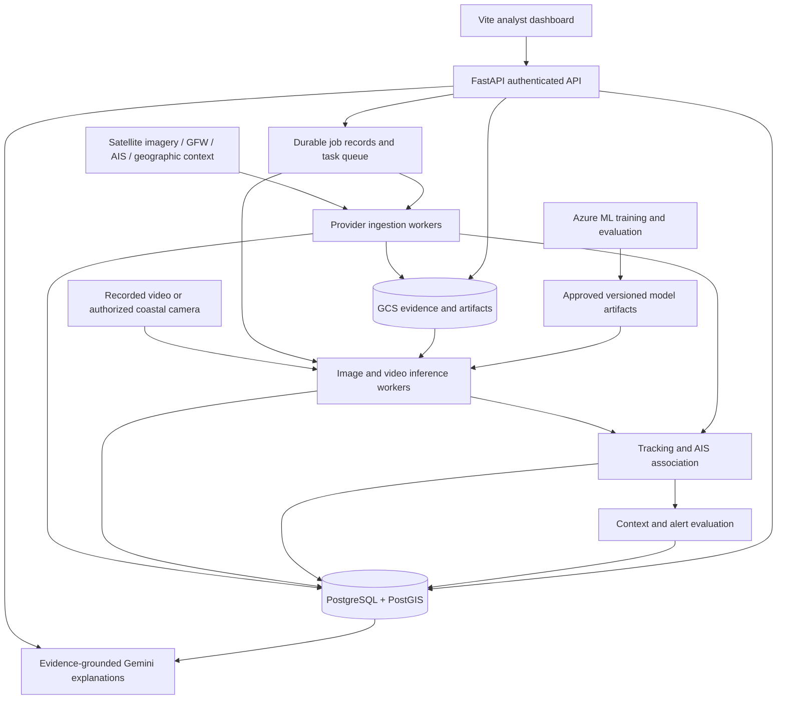

# OceanGuard End-to-End Development and Architecture Plan

Status: proposed implementation plan, not a statement that these capabilities are deployed.

This is the main planning document for upgrading OceanGuard from a demo-style vessel detection dashboard into a research-grade and industry-ready maritime intelligence system. It is intentionally written as an implementation guide: another engineer or agent should be able to follow it without choosing a new architecture.

## 1. Product goal and scope

OceanGuard should find vessel observations, connect observations over time where evidence permits, compare them with AIS and geographic context, and help an analyst investigate explainable alerts. The system should be honest about uncertainty: a missing signal, expired provider, cloudy acquisition, sparse AIS sample, or low-confidence model result must appear as limited evidence, not as proof of vessel behavior.

There are two connected operating modes:

1. Satellite monitoring: search an area for available acquisitions, detect vessels in suitable SAR imagery, and compare those observations with historical AIS and protected areas.
2. Coastal monitoring: process repeated camera frames and AIS messages to maintain tracks and investigate motion over time. Begin with synchronized recorded datasets; connect a real camera when available.

Satellite acquisitions are intermittent. They are useful for wide-area and historical evidence, but they cannot supply a continuous video track. Coastal cameras and recorded video are the path for continuous tracking. A drone is an optional additional camera for local inspection after the core software is reliable; physical drone control, autonomous flight, and aviation compliance are outside the initial software scope.

The first delivery is an integrated, testable prototype. Coding can be accelerated, but dataset access, GPU availability, training duration, and independent evaluation still determine when research claims are justified. Execute the stages below by acceptance criteria rather than by calendar week. The implementation order starts with source truth and persistence before model fine-tuning, because retraining cannot fix incorrect timestamps, misleading provider semantics, discarded observations, or unstable review state.

## 2. Current repository and intended modifications

The following structure was inspected locally while writing this plan. Hosted services were not checked in this documentation task.

| Existing component | Intended change |
|---|---|
| `frontend/`: React 18, TypeScript, Vite, Leaflet | Keep the dashboard; add source health, coverage, histories, replay, jobs, and evidence views |
| `backend/app/main.py`: FastAPI with startup background ingestion | Keep the API; move recurring ingestion and expensive processing to durable workers |
| `backend/app/services/gfw_ingest.py` | Preserve provider semantics, provenance, timestamps, and all valid records |
| `backend/app/services/ais_stream.py` | Introduce durable messages, history, time alignment, and availability states |
| `backend/app/services/sentinel_sar.py` | Record scene metadata and reuse a versioned SAR preprocessing contract |
| `backend/app/services/mpa_index.py` | Preserve spatial lookup; version boundaries and evaluate geographic accuracy |
| `backend/app/store/` | Migrate process/file state into PostgreSQL/PostGIS through a repository interface |
| `backend/app/api/routes/verify.py` | Make verification repeatable without accumulating risk; validate location and acquisition correspondence |
| `backend/app/agents/` | Generate explanations from retrieved evidence with source references |
| `yolo-service/` | Version model serving and preprocessing; return boxes and provenance separately from risk |
| `ml/` | Add dataset manifests, reproducible training, evaluations, tracking benchmarks, and model packaging |
| `.github/workflows/deploy-*.yml` | Retain separate service deployment; add tests, staging checks, migrations, and rollback gates |

The recorded baseline in `backend/data/metrics.json` is YOLO11n, 50 epochs, 2,857 training images and 715 validation images, mAP50 0.838, mAP50-95 0.579, precision 0.830, and recall 0.818. These are repository-recorded results, not reproduced results or current production accuracy. The listed 122 scene detections are a count, not an accuracy score.

## 3. Target architecture

Start with a modular backend and a few worker processes. Separate responsibilities through explicit contracts without creating a microservice for every module.

GCP continues to host the application. Azure supplies training compute and experiment storage. Export only approved, checksummed model artifacts to the deployment registry. Serving must not require Azure training jobs to stay running.

## 4. Plain-language system flow

This is how the upgraded system should behave from a user point of view.

1. The user selects a point, draws an area, or opens a monitored coastal site in the dashboard.
2. The frontend sends the selected geometry, time range, and requested mode to the FastAPI backend.
3. The backend checks which sources can answer that request: satellite catalog, existing SAR evidence, recorded or live camera frames, AIS history, MPA boundaries, and geofences.
4. If suitable satellite imagery exists, the SAR workflow processes the acquisition with the approved model. If coastal video exists, the video workflow detects vessels frame by frame and links detections into tracks.
5. The system matches each observation or track against AIS messages by time, location, motion, and uncertainty. It returns `matched`, `unmatched`, `ambiguous`, or `unavailable`; missing AIS is never treated as automatic proof that a transponder was deliberately disabled.
6. The spatial layer compares the observation or track with MPAs, exclusion zones, port areas, and other configured boundaries.
7. The rules layer creates alerts only when there is enough evidence, such as zone entry, unusual dwell, route deviation, status/motion inconsistency, or repeated missing association under usable AIS coverage.
8. The dashboard shows observations, tracks, source coverage, evidence chips, AIS candidates, MPA context, alert reasoning, and review status.
9. Gemini can explain the evidence in analyst-friendly language, but deterministic records and rules remain the source of truth.

The key idea: OceanGuard should not simply draw red dots. It should show what was observed, when it was observed, which source produced it, how confident the system is, what matching evidence exists, and what remains unknown.

### Satellite versus coastal tracking

Satellite SAR is best for wide-area detection and evidence snapshots. It can reveal vessel-like objects even when AIS is absent, and it can cover remote regions where no camera exists. Its limits are revisit time, acquisition availability, resolution, and scene conditions. A vessel can move far between satellite passes, so satellite observations are usually point-in-time evidence rather than a continuous track.

Coastal camera monitoring is best for continuous local tracking. It can maintain identity through frames, measure movement, and support stronger behavior analysis when calibration and timing are reliable. Its limits are field of view, weather, night conditions unless thermal exists, occlusion, camera placement, and calibration quality.

Drones should be treated as another camera source. They can help inspect a selected incident or collect extra evidence, but the first research contribution should not depend on autonomous drone control. Build the software so drone imagery can enter later through the same evidence, observation, and tracking contracts.

## 5. Source handling and data truth

Each provider adapter must return a source identifier, source record identifier, acquisition or observation time, ingestion time, geometry, units, quality information, and a reference to the original response or evidence.

- Keep GFW grid summaries in an `ActivityAggregate` layer. A grid count must not become a uniquely identified vessel or a model confidence value.
- Store observation-level provider detections only when the response actually contains observation-level evidence.
- Deduplicate by provider identity and acquisition provenance. Do not discard distinct vessels merely because they occupy the same geographic cell.
- Preserve missing timestamps as unknown. Never replace them with the current time and present the result as a fresh acquisition.
- Cluster and paginate for the map without deleting stored observations.
- Keep seed/demo data explicitly labeled and separate from operational observations.
- Preserve the last successful dataset during provider failure and mark its age.
- Record coverage as space, time, sensor, and availability. Global MPA polygons do not imply global vessel observations.

Provider health must distinguish configured, healthy, degraded, unauthorized, quota-limited, unavailable, and stale. A configured key alone proves no connectivity. Use bounded real requests, cache results, and redact credentials in diagnostics. Refresh OAuth tokens where supported; static token renewal can require account-owner action.

## 6. Persistent data model

Use database migrations and UTC timestamps. Store geometries with an explicit coordinate reference system; use appropriate metric/geodesic calculations for distance. Store large imagery and videos in object storage instead of database rows.

| Record | Main fields and purpose |
|---|---|
| `Source` | Provider, configuration reference, capabilities, status, last success, error category |
| `Acquisition` | Scene/video identifier, sensor, footprint, start/end time, resolution, evidence URI |
| `Observation` | Stable ID, source ID, acquisition ID, observed/ingested time, geometry or image box, uncertainty, model version |
| `ActivityAggregate` | Grid geometry, interval, count, measure, provider; never an individual vessel identity |
| `AISMessage` | MMSI as reported, message time, receive time, location, speed, course, heading, navigation status, quality |
| `Track` | Stable internal ID, sensor/domain, lifecycle state, first/last observation, optional identity hypothesis |
| `TrackPoint` | Track ID, timestamp, position or image coordinates, observed/predicted flag, uncertainty, observation reference |
| `Association` | Candidate tracks/observations, AIS reference, method version, score, decision, rejection reasons |
| `Zone` | Boundary, designation, effective dates, source/version, applicable rules if known |
| `Alert` | Rule/version, supporting evidence, interval, severity, uncertainty, deduplication key, review status |
| `Evidence` | Immutable object URI, checksum, acquisition metadata, preprocessing and model versions |
| `Review` | Analyst, decision, reason, timestamp, related alert, audit history |
| `Job` | Request, state, progress, idempotency key, attempts, result, failure category |
| `ModelVersion` | Artifact digest, dataset/split versions, preprocessing, metrics, approval state |

Database constraints enforce source deduplication and valid references. Reviews are appended rather than silently overwritten. Record processing versions so new models can reprocess evidence without destroying earlier results.

## 7. End-to-end user flows

### Select a point or area on the map

1. The browser sends a point plus radius, or a polygon, a time interval, and requested sensor mode.
2. The API validates geometry, authorization, area size, time range, and quota, then returns a job ID.
3. A worker checks provider coverage and catalog availability. No imagery produces a clear no-coverage result.
4. Reuse cached acquisitions or fetch suitable evidence. Preserve the actual capture time.
5. Apply versioned preprocessing and inference, merge overlapping tile results, and store observations.
6. Retrieve AIS around the acquisition time, evaluate candidate matches and uncertainty, and calculate spatial context.
7. The UI displays observations, coverage, acquisition age, evidence, association state, and any justified alerts.

Clicking the map does not request an instant new satellite photograph. It searches available observations for that place and time.

### Process a video or camera stream

1. Register the source with timestamps, frame rate, calibration, and available camera pose metadata.
2. Detect vessels in frames and track them within the sequence.
3. Store image-space tracks even when geographic calibration is unavailable.
4. Convert to world coordinates only when calibration and uncertainty support it.
5. Compare eligible tracks with time-aligned AIS, preserving ambiguous candidates.
6. Display synchronized video and map history. Mark extrapolated positions as predicted.

Camera pixels cannot become valid latitude/longitude simply from a bounding box. Fixed-camera geometry and moving-drone pose require different calibration methods.

### Review an alert

An analyst opens the alert, checks its timeline, imagery, AIS candidates, zone context, and uncertainty, then records a decision. An evidence export includes the relevant source times, IDs, model versions, and review history. Gemini may explain that evidence; deterministic logic owns identity decisions and alert rules.

## 8. Detection and fine-tuning plan

Yes, fine-tuning is planned. First reproduce a baseline and fix the input pipeline so training addresses a measured problem.

1. Inventory existing weights, configurations, source datasets, label formats, and training logs. Mark missing provenance explicitly.
2. Create versioned dataset manifests with checksums, permissions, sensor/resolution information, scene identifiers, and split membership.
3. Split by acquisition, location, capture session, or complete sequence. Prevent adjacent frames and overlapping scene tiles from leaking across splits.
4. Freeze the test set. Select parameters and thresholds only using training/validation data.
5. Reproduce the existing detector on its recoverable evaluation set; save raw predictions and failure examples.
6. Standardize SAR inputs: channel handling, units, normalization, no-data handling, georeferencing, tile size, overlap, and edge merging. Match training and serving transformations.
7. Fine-tune a SAR model using suitable HRSID/SSDD data and evaluate full-scene transfer with xView3, subject to dataset permissions and compatibility.
8. Train a separate optical camera/video detector using appropriate maritime datasets. Do not assume SAR weights directly solve RGB or thermal detection.
9. Compare the existing YOLO family baseline with a reproducible RT-DETR-family baseline under equal data and compute budgets.
10. Begin with small smoke runs; use a configurable maximum of 100 epochs and validation-based early stopping for full runs. Evaluate selected configurations across three seeds when budget permits.
11. Add targeted hard negatives such as waves, docks, land structures, and glare; measure performance by vessel size and environment.
12. Package the selected model together with preprocessing, class definitions, thresholds, evaluation artifacts, and a model card.

Initial dataset candidates: FVessel for synchronized camera/AIS experiments; ShipsMOT and Singapore Maritime Dataset for visual tracking/detection; SeaDronesSee for aerial robustness; HRSID/SSDD/xView3 for SAR; NOAA/Danish AIS for trajectory work. Verify availability, labels, and licenses before downloading. A public dataset does not automatically grant commercial redistribution rights.

Tracking motion models and assignment algorithms do not necessarily need fine-tuning. Train appearance embeddings only if evaluation shows an identity-association benefit. Defer learned anomaly models until reliable trajectories and credible labels exist. Gemini fine-tuning is not required for this architecture.

## 9. Azure training architecture

Proposed resources: Azure ML workspace, private Blob storage for permitted datasets/artifacts, a GPU compute cluster with bounded scaling, a container environment, experiment tracking, and identity-based storage access.

- Parameterize subscription, resource group, region, compute SKU, maximum nodes, and job budget. GPU quota and actual cost must be checked before job submission.
- Upload datasets once, retaining manifests and checksums; avoid repeated large cross-cloud transfers.
- Run preparation, baseline, training, evaluation, and packaging as separate restartable jobs.
- Save checkpoints, environment versions, seeds, configuration, predictions, metrics, and logs for every experiment.
- Limit concurrent jobs and runtime; scale training compute to zero when idle and configure budget alerts.
- Promote only models passing the evaluation gate; export approved artifacts to GCS or the application artifact pipeline with digest verification.

Required external inputs are Azure account access through supported authentication, GPU quota, an agreed spending limit, permitted datasets, and any required download approvals. Secrets belong in managed secret stores, never repository files or chat.

## 10. Tracking and association

Establish detector-plus-ByteTrack and detector-plus-BoT-SORT baselines on complete labeled video sequences. Give tracks stable internal IDs and explicit states: tentative, confirmed, predicted, lost, and ended. A recovered identity is a hypothesis until evidence supports the link.

For AIS association, align by observation time, constrain candidates using motion and positional uncertainty, and solve assignments across candidates rather than choosing the nearest point independently. Preserve alternatives and reasons for rejection. An MMSI is a reported identity, not independent proof of identity.

Use four public association states:

- `matched`: sufficient supporting evidence for the selected association.
- `unmatched`: usable coverage exists but no candidate meets the criteria.
- `ambiguous`: several candidates remain plausible.
- `unavailable`: insufficient AIS coverage, timing, or source availability.

Research extension: include observation age, source availability, clock/calibration error, and uncertainty in assignment and recovery. Permit abstention. Compare against baseline association methods with controlled outages and naturally missing observations. Satellite cross-acquisition identity needs its own experiment and must not inherit video tracking claims.

## 11. Context and behavior intelligence

Start with versioned explainable rules: zone entry, sustained dwell, speed/course changes, route deviation, reported navigation-status inconsistency, and possible encounters. Require minimum duration and adequate observations; use hysteresis and deduplication to prevent repeated alert storms.

Keep detection confidence, identity confidence, behavioral evidence, and review priority as separate fields. MPA proximity alone does not establish fishing, authorization status, or an offence. Unknown rules and missing context must remain visible.

Verification must reference a specific acquisition, target location, model, and preprocessing version. Repeating the same verification returns the stored result and cannot repeatedly increase risk. Another vessel in a large image chip does not verify the selected target.

## 12. API contracts and dashboard

Proposed versioned endpoints, to be finalized through OpenAPI contracts:

| API | Purpose |
|---|---|
| `GET /v1/sources/health` | Provider availability, last success, age, and safe failure details |
| `GET /v1/coverage` | Spatial/temporal availability for a sensor and area |
| `GET /v1/observations` | Cursor-paginated observations filtered by area, time, and source |
| `GET /v1/activity` | Separate aggregate activity layer |
| `GET /v1/tracks` and `/v1/tracks/{id}` | Track summaries, history, and identity hypotheses |
| `GET /v1/alerts` | Filtered alerts and supporting evidence |
| `POST /v1/analysis-jobs` | Authorized point, area, or recorded-video analysis |
| `GET /v1/jobs/{id}` | Progress, result references, or failure |
| `POST /v1/alerts/{id}/reviews` | Audited analyst decision |
| `GET /v1/evidence/{id}` | Authorized metadata and short-lived media access |

Maintain compatibility for existing risk-event clients through a documented adapter while the dashboard migrates. Define which legacy fields cannot be populated truthfully and avoid inventing values to satisfy old UI expectations.

Dashboard work includes layer toggles for aggregates, observations, tracks, and MPAs; capture-time and stale-data badges; source-health details; map/video timeline replay; association explanations; job progress; analyst review; and mobile-friendly evidence panels. Use viewport queries and display clustering. Show empty, unavailable, loading, and failed states separately.

## 13. Runtime, deployment, and operations

Keep Vite/nginx and FastAPI on their existing Cloud Run deployment path. Use Cloud SQL with PostGIS for durable state and GCS for immutable evidence. Begin with a durable task queue and scheduled finite ingestion jobs. Continuous AIS sockets and long-running video sessions need a supervised persistent worker or edge host; do not assume an ordinary request-driven API instance will maintain them reliably.

Use a database outbox or equivalent reliable handoff between committed records and processing tasks. Workers must tolerate duplicate delivery, resume from checkpoints, retry temporary failures with bounded backoff, and send exhausted jobs to a reviewable failure queue. Serialize provider calls where provider limits require it.

Use separate identities for deployment, API, workers, and training with scoped access. Public demo viewing can remain read-only. Protect mutation, upload, export, and expensive inference operations with authentication, roles, quotas, and input limits. Use secret references and short-lived federated CI credentials.

Deployment sequence: tests and container build; staging deployment; backward-compatible database migration; smoke test; representative inference test; application promotion; production smoke test. Retain previous application and model versions for rollback. Defer destructive schema cleanup until all clients have migrated.

Observe provider success/latency, ingestion lag, acquisition age, queue delay, inference latency, track loss, alert volume, database failures, and cost per job. Propagate a request/job identifier across logs. Configure backups and retention by data category, then test restoration rather than assuming backups work.

## 14. Implementation order and acceptance gates

| Stage | Deliverable | Required evidence before proceeding |
|---|---|---|
| A. Baseline audit | Reproducible local setup, provider inventory, known failures | Real bounded provider probes and documented failure categories; no claim that missing keys are necessarily expired |
| B. Truth corrections | Aggregates separated, stable provenance, AIS uncertainty, idempotent verification | Regression tests for unknown time, empty AIS, duplicate verification, and multiple vessels in one cell |
| C. Persistence | Migrations, PostGIS repositories, evidence storage, reviews | Restart and multiple-instance tests retain history and decisions; migration/restore test |
| D. Jobs and sources | Durable jobs, scheduled ingestion, retry, health and coverage | Duplicate-delivery, crash/restart, quota, and provider-failure tests |
| E. SAR workflow | Point/area request through acquisition, inference, and evidence UI | Known-scene integration test and explicit no-coverage behavior |
| F. Training pipeline | Azure job templates, dataset registry, reproduced baseline, candidate models | Stored artifacts, leakage checks, fixed test evaluation, budget controls |
| G. Tracking replay | Video ingestion, baseline trackers, timeline | HOTA/IDF1 and identity-switch results on held-out complete sequences |
| H. AIS fusion | Time alignment, candidate assignment, abstention, recovery | Association precision/coverage and outage-recovery evaluation |
| I. Alerts and review | Context rules, cases, grounded explanations | Event-level evaluation and human review traceability |
| J. Release | Dashboard integration, staging, deployment, rollback | Full user journey, authorization, load, restore, and production smoke checks |
| K. Research extension | Availability-aware method and benchmark | Ablations, equal-budget comparisons, confidence intervals, external test data |

Stages E and F can proceed in parallel once input contracts are fixed. Dashboard work can follow agreed API fixtures while backend stages run. Do not train on new labels until the split registry is frozen; do not implement learned behavior scoring before track quality is measured.

For each Codex task: inspect relevant source and repository instructions, describe the slice, implement it, run focused checks, update its documentation, and report verified outcomes. Publish only scoped changes when instructed. Avoid bundling every stage into one unreviewable commit.

## 15. Evaluation and completion criteria

- Detection: mAP50-95, precision/recall, small-vessel recall, false alarms per image or area, and performance by sensor/environment.
- Tracking: HOTA, IDF1, identity switches, fragmentation, and reacquisition delay.
- Association: correct assignment precision versus assignment coverage, ambiguity, abstention, and calibration.
- Alerts: event precision/recall, false alerts per vessel-hour, and analyst usefulness on labeled cases.
- Operations: latency, source lag, queue recovery, processing cost, and database/evidence durability.

Report results separately for clear/occluded targets, day/night where supported, small/large targets, normal/degraded input, and familiar/unseen locations. Use sequence- or scene-level confidence intervals. Synthetic outages supplement natural missing-data evaluation; they do not replace it.

Existing roadmap targets of 5-10 additional HOTA points, 20-40% fewer identity switches, and 20-30% fewer false alerts are hypotheses to test after baselines exist. Do not promise these gains or turn them into reported results.

The integrated prototype is complete when an analyst can select an area and time, understand available coverage, run analysis, inspect genuine evidence, replay supported tracks, see AIS uncertainty, review an alert, and retain that decision across deployments. Research readiness additionally requires reproducible datasets, baselines, ablations, and independent held-out evaluation. Live coastal readiness additionally requires a suitable real sensor feed and field validation.

## 16. Concrete first implementation slice

Start with source health, acquisition provenance, aggregate/observation separation, safe AIS states, and idempotent verification. These changes make existing results interpretable and prevent more training from hiding data-pipeline errors. Then add persistence and jobs before scaling ingestion or model training.

### First implementation checkpoint (September 25, 2026)

- GFW 4Wings report rows now enter a process-local `ActivityAggregate` snapshot with dataset, report interval, provider time when supplied, and ingestion time. `/activity/gfw` supports bbox filtering and pagination. The dashboard shows cyan activity cells separately from case records.
- `/ingest/status` reports process-local attempt/success times and sanitized failure categories. A failed refresh retains the last successful in-memory snapshot; a restart still loses it.
- The short AIS sample returns matched or ambiguous candidates only when message and observation times are close. An empty or unrelated sample is unavailable and cannot confirm deliberate AIS disabling.
- YOLO point scans no longer add to risk. The model service does not yet return a scene acquisition identifier or time, so a nearby model hit remains an unverified lead.
- The risk-event seed remains for demo cases. Persistent observation records, historical AIS, durable jobs, authentication, provider probes, and exact SAR scene provenance are still pending.

### Persistence checkpoint (September 25, 2026)

- A versioned PostGIS migration now defines spatial case and activity tables, append-only review history, and source snapshot state. `python -m app.store.migrate` applies it before database mode is enabled.
- When `DATABASE_URL` is supplied, the API selects PostgreSQL repositories for case records and GFW activity. Repeated identical GFW reports reuse a content-derived snapshot; changed reports retain separate snapshots. Review updates lock the case row and append a history record in one transaction.
- Local mode remains available for development. No Cloud SQL database, credentials, or live migration was supplied, so the database path still requires integration and restart tests against a dedicated instance. Persistent observations, tracks, evidence objects, durable jobs, and authenticated mutations remain for subsequent slices.

### Durable-job checkpoint (September 25, 2026)

- A second migration adds a database-backed GFW refresh queue with stable deduplication keys, leased claims, bounded retry delays, and a terminal state after exhausted attempts. Lease-token fencing prevents a prior worker from completing a reclaimed job.
- The finite worker command fetches one report and publishes the snapshot in the same transaction as job completion. Source failure retains the previous snapshot and records a sanitized failure category. Provider fetch and database storage failures remain distinct.
- This is queue infrastructure, not a deployed schedule. A dedicated PostGIS integration test is opt-in; Cloud SQL, Cloud Run Jobs/Scheduler, live credentials, and production operation still require setup and validation. The API startup/manual refresh path remains in place for compatibility until cutover.

### SAR provenance checkpoint (September 26, 2026)

- Point and area YOLO verification now validate coordinates and ISO request times before calling the inference service. Responses carry the requested center/time, provider, optional acquisition identifiers, and an explicit `coverage_status`.
- When the inference service does not return a scene ID and observed acquisition time, the API reports `scene_time_unverified`. This is intentional: a successful image response or model detection is not presented as proof of the exact satellite pass.
- The frontend displays this evidence state beside the model result. The result remains an observation candidate and does not establish vessel identity, AIS absence, or unauthorized activity. A future acquisition adapter must supply scene metadata before changing this state.

### Source-health checkpoint (September 26, 2026)

- GET /sources/status now presents one read-only readiness view for GFW activity, AISStream, Sentinel Hub, and the YOLO service. It reports configuration, recent activity state where available, sanitized error categories, and source limitations.
- Configured means credentials or a service URL are present; it does not mean the provider is reachable, authorized, current, or returning useful coverage. AIS remains sample_only, and Sentinel/YOLO remain on_demand until durable observation and acquisition records are implemented.

### Operational-record checkpoint (September 26, 2026)

- Migration 003 defines durable acquisitions, observations, evidence references, AIS messages, tracks, track points, associations, and deduplicated alerts with spatial and temporal indexes.
- A PostGIS operational repository and versioned read APIs now expose observations, track points, and alerts when DATABASE_URL is configured. Local demo mode returns an explicit database-not-configured response and does not convert sample risk events into fake tracks.
- Worker write adapters, authenticated mutation routes, GCS object storage, and live Cloud SQL validation remain pending. No tracking result or alert quality claim is implied by the schema alone.

### Association-policy checkpoint (September 26, 2026)

- A deterministic time-distance association service now produces auditable matched, unmatched, ambiguous, and unavailable decisions with method versions and rejection reasons.
- Alert generation is conservative and deduplicated: unavailable AIS creates no alert, while unmatched or ambiguous results create review candidates that explicitly avoid claiming illegal activity or deliberate AIS disabling.
- This is a rules baseline, not a trained tracker or behavior model. It must be evaluated against labeled sequences after observation and AIS ingestion workers are implemented.

### Dataset and tracking baseline checkpoint (September 26, 2026)

- `ml/datasets/splits.py` now creates deterministic, group-safe split manifests from JSON or JSONL records. A sequence, scene, or capture session remains entirely in one split, and the manifest records the seed, ratios, groups, and record ids. This prevents leakage before fine-tuning begins.
- `ml/pipeline/tracking.py` now provides a dependency-light nearest-neighbor constant-velocity baseline. It emits stable track ids, confirmed/tentative states, and short-gap predicted points so later HOTA, IDF1, identity-switch, and recovery experiments have a reproducible reference.
- The dataset archives are not yet fully collected, normalized, or licensed for redistribution. No detector has been fine-tuned with the new datasets, and the tracker has not been evaluated on labeled coastal sequences yet.

Related documents: [research roadmap](coastal-vessel-tracking-roadmap.md), [existing architecture](architecture.md), [SAR and map selection](live-sar-and-user-selection-flow.md), and [training explanation](modules/model-training-and-evaluation.md).
